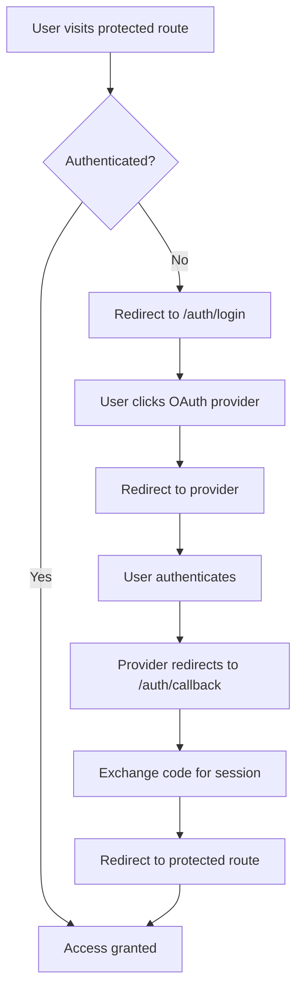

# Authentication Overview

CodeCave uses Supabase Auth with OAuth providers for secure user authentication.

## Authentication Flow



## Key Components

### 1. Middleware Protection
- **File**: `src/middleware.ts`
- **Purpose**: Protects routes globally
- **Behavior**: Redirects unauthenticated users to login

```typescript
// Middleware checks authentication on every request
export async function middleware(request: NextRequest) {
  return await updateSession(request);
}
```

### 2. OAuth Providers
Supported providers:
- **Google** - Primary OAuth provider
- **GitHub** - Developer-focused authentication
- **Discord** - Community-based authentication

### 3. Server Actions
- **File**: `src/app/auth/login/actions.ts`
- **Functions**:
  - `loginWithGoogle()`
  - `loginWithGitHub()`
  - `loginWithDiscord()`
  - `signOut()`

### 4. Callback Handler
- **File**: `src/app/auth/callback/route.ts`
- **Purpose**: Exchanges OAuth code for session
- **Flow**: Receives code → Creates session → Redirects to destination

## Session Management

### Server-Side Authentication
```typescript
// Get user on server
const supabase = await createClient();
const { data: { user } } = await supabase.auth.getUser();
```

### Client-Side Authentication
```typescript
// Get user on client
const supabase = createClient();
const { data: { user } } = await supabase.auth.getUser();
```

## Route Protection Levels

### 1. Middleware Level (Global)
- Protects all routes except `/auth/*`
- Automatic redirect to login
- Session refresh handling

### 2. Page Level (Specific)
```typescript
// Protected page component
export default async function PrivatePage() {
  const supabase = await createClient();
  const { data, error } = await supabase.auth.getUser();
  
  if (error || !data?.user) {
    redirect("/auth/login");
  }
  
  return <div>Protected content</div>;
}
```

## User Data Structure

```typescript
interface User {
  id: string;
  email: string;
  user_metadata: {
    avatar_url?: string;
    full_name?: string;
    name?: string;
    picture?: string;
  };
  app_metadata: {
    provider: "google" | "github" | "discord";
    providers: string[];
  };
}
```

## Security Features

- **PKCE Flow**: Secure OAuth implementation
- **Session Refresh**: Automatic token renewal
- **CSRF Protection**: Built into Supabase Auth
- **Secure Cookies**: HTTPOnly, Secure, SameSite
- **Route-level Protection**: Granular access control

## Next Steps

- [OAuth Setup Guide](./oauth-setup.md) - Configure OAuth providers
- [Route Protection](./route-protection.md) - Implement protected routes
- [Troubleshooting](./troubleshooting.md) - Common issues and solutions