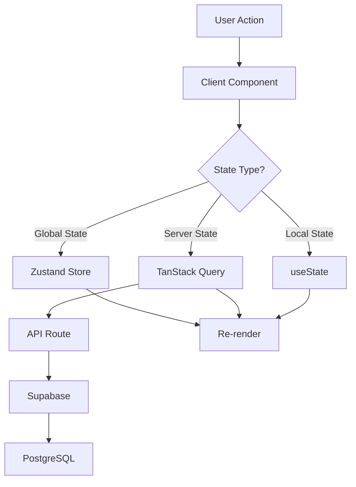

# Technical Architecture

[← Back to Index](./codecave-index.md) | [Next: Database Schema →](./database-schema.md)

## Technology Stack

### Core Technologies

```yaml
Frontend:
  - Next.js: 15.0.0
  - React: 19.0.0
  - TypeScript: 5.3+
  - Tailwind CSS: 3.4
  - Shadcn/ui: Latest

State Management:
  - Zustand: 4.5.0
  - Immer: 10.0.0
  - TanStack Query: 5.0.0

Backend & Database:
  - Supabase: 2.39.0
    - PostgreSQL: 15
    - Auth: OAuth providers
    - Storage: Files & images
    - Realtime: Subscriptions
    - Edge Functions: Deno runtime

Code Processing:
  - Shiki: Syntax highlighting
  - Prettier: Code formatting
  - Monaco Editor: Code editing
  - Linguist: Language detection

Infrastructure:
  - Vercel: Hosting & Edge Functions
  - Cloudflare R2: CDN & Storage
  - Sentry: Error tracking
  - PostHog: Analytics
  - Stripe: Payments
  - Resend: Transactional emails
```

## Project Structure

```
codecave/
├── src/
│   ├── app/                          # Next.js App Router
│   │   ├── (public)/                # Guest-accessible routes
│   │   │   ├── page.tsx            # Landing/Feed page
│   │   │   ├── explore/           # Explore page
│   │   │   ├── trending/          # Trending posts
│   │   │   ├── groups/            # Public groups
│   │   │   └── u/[username]/      # Public profiles
│   │   │
│   │   ├── (authenticated)/         # Auth-required routes
│   │   │   ├── dashboard/         # User dashboard
│   │   │   ├── editor/           # Post editor
│   │   │   │   ├── new/         # Create post
│   │   │   │   └── [id]/       # Edit post
│   │   │   ├── settings/        # User settings
│   │   │   └── groups/         # Group management
│   │   │
│   │   ├── auth/                    # Auth routes
│   │   │   ├── callback/          # OAuth callback
│   │   │   └── signout/          # Sign out
│   │   │
│   │   ├── api/                     # API routes
│   │   │   ├── posts/            # Posts CRUD
│   │   │   ├── users/            # User operations
│   │   │   ├── groups/           # Groups API
│   │   │   ├── code/             # Code processing
│   │   │   └── webhooks/         # External webhooks
│   │   │
│   │   └── layout.tsx              # Root layout
│   │
│   ├── components/                  # React components
│   │   ├── auth/                   # Auth components
│   │   ├── editor/                 # Editor components
│   │   │   ├── blocks/           # Block components
│   │   │   └── toolbar/          # Editor toolbar
│   │   ├── feed/                   # Feed components
│   │   ├── groups/                 # Group components
│   │   ├── layout/                 # Layout components
│   │   └── ui/                     # Base UI components
│   │
│   ├── lib/                         # Utilities
│   │   ├── supabase/              # Supabase clients
│   │   ├── code/                  # Code processing
│   │   ├── algorithms/            # Feed algorithms
│   │   └── notion/                # Template generation
│   │
│   ├── stores/                      # Zustand stores
│   │   ├── auth.store.ts          # Auth state
│   │   ├── editor.store.ts        # Editor state
│   │   ├── feed.store.ts          # Feed preferences
│   │   └── ui.store.ts            # UI state
│   │
│   ├── hooks/                       # Custom hooks
│   ├── types/                       # TypeScript types
│   └── utils/                       # Helper functions
│
├── public/                          # Static assets
├── docs/                           # Documentation
└── tests/                          # Test files
```

## Architecture Patterns

### 1. Server Components by Default

```typescript
// app/page.tsx - Server Component
export default async function HomePage() {
  // This runs on the server
  const posts = await fetchPosts();

  return (
    <div>
      {/* Client component only where needed */}
      <InteractiveFilter />

      {/* Server-rendered content */}
      {posts.map((post) => (
        <PostCard key={post.id} post={post} />
      ))}
    </div>
  );
}
```

### 2. Route Groups for Organization

```typescript
// (public) - No authentication required
// (authenticated) - Requires auth
// (admin) - Admin only routes

// Shared layouts per group
export default function PublicLayout({ children }) {
  return (
    <>
      <PublicNavbar />
      {children}
    </>
  );
}
```

### 3. API Route Patterns

```typescript
// app/api/posts/route.ts
export async function GET(request: Request) {
  // List posts
}

export async function POST(request: Request) {
  // Create post
}

// app/api/posts/[id]/route.ts
export async function GET(
  request: Request,
  { params }: { params: { id: string } }
) {
  // Get single post
}

export async function PATCH() {
  // Update post
}

export async function DELETE() {
  // Delete post
}
```

### 4. State Management Strategy

```typescript
// Global state with Zustand
const useAuthStore = create<AuthState>()(...)

// Server state with TanStack Query
const { data, isLoading } = useQuery({
  queryKey: ['posts', filters],
  queryFn: fetchPosts,
})

// Local state with useState
const [isOpen, setIsOpen] = useState(false)
```

## Data Flow Architecture



## Security Architecture

### 1. Authentication Flow

```typescript
// OAuth only - no passwords stored
const providers = ["discord", "google", "github"];

// Middleware protection
export async function middleware(request: NextRequest) {
  const session = await getSession(request);

  if (!session && request.nextUrl.pathname.startsWith("/dashboard")) {
    return NextResponse.redirect(new URL("/", request.url));
  }
}
```

### 2. Row Level Security (RLS)

```sql
-- Users can only edit their own posts
CREATE POLICY "Users can update own posts" ON posts
  FOR UPDATE USING (auth.uid() = user_id);

-- Public posts visible to all
CREATE POLICY "Public posts are viewable by everyone" ON posts
  FOR SELECT USING (is_published = true);
```

### 3. Input Validation

```typescript
// Zod schemas for validation
const postSchema = z.object({
  title: z.string().min(1).max(200),
  blocks: z.array(blockSchema),
  tags: z.array(z.string()).max(5),
});

// Validate before processing
const validated = postSchema.parse(requestBody);
```

## Performance Optimization

### 1. Edge Rendering

```typescript
// Use edge runtime for better performance
export const runtime = "edge";

// Static generation where possible
export const revalidate = 3600; // 1 hour
```

### 2. Image Optimization

```typescript
// Automatic optimization with Next.js
import Image from "next/image";

// Cloudflare Images for user uploads
const optimizedUrl = await uploadToCloudflare(file);
```

### 3. Code Splitting

```typescript
// Dynamic imports for heavy components
const MonacoEditor = dynamic(() => import("@monaco-editor/react"), {
  ssr: false,
});
```

### 4. Database Optimization

```sql
-- Indexes for common queries
CREATE INDEX idx_posts_user_published
  ON posts(user_id, is_published, published_at DESC);

CREATE INDEX idx_posts_tags
  ON posts USING GIN(tags);

-- Materialized views for expensive queries
CREATE MATERIALIZED VIEW trending_posts AS
  SELECT * FROM posts
  WHERE published_at > NOW() - INTERVAL '24 hours'
  ORDER BY (like_count * 2 + comment_count) DESC;
```

## Scaling Strategy

### Phase 1: Monolith (0-10k users)

- Single Next.js app on Vercel
- Supabase managed database
- Cloudflare CDN for assets

### Phase 2: Optimizations (10k-50k users)

```typescript
// Add caching layer
const cached = await redis.get(key);
if (cached) return cached;

// Database read replicas
const readDb = supabase.from("posts").select();

// Edge functions for heavy operations
export const config = { runtime: "edge" };
```

### Phase 3: Service Extraction (50k+ users)

```yaml
Services to extract:
  - code-formatter: AWS Lambda
  - notification-worker: Separate process
  - search-service: Elasticsearch
  - image-processor: Cloudflare Workers
```

## Monitoring & Observability

### 1. Error Tracking

```typescript
// Sentry integration
Sentry.init({
  dsn: process.env.SENTRY_DSN,
  environment: process.env.NODE_ENV,
  tracesSampleRate: 0.1,
});
```

### 2. Performance Monitoring

```typescript
// Web Vitals tracking
export function reportWebVitals(metric) {
  analytics.track("Web Vitals", {
    name: metric.name,
    value: metric.value,
  });
}
```

### 3. Application Metrics

```typescript
// Custom metrics
const metrics = {
  postsCreated: counter("posts.created"),
  apiLatency: histogram("api.latency"),
  activeUsers: gauge("users.active"),
};
```

## Development Workflow

### 1. Environment Setup

```bash
# Development
npm run dev

# Type checking
npm run type-check

# Linting
npm run lint

# Testing
npm run test
```

### 2. Git Workflow

```bash
main
├── develop
│   ├── feature/block-editor
│   ├── feature/groups
│   └── fix/auth-redirect
```

### 3. Deployment Pipeline

```yaml
# Automatic deployment on push
- Push to main -> Production
- Push to develop -> Staging
- PR creation -> Preview deployment
```

## Next Steps

Continue to [Database Schema](./03-database-schema.md) →
